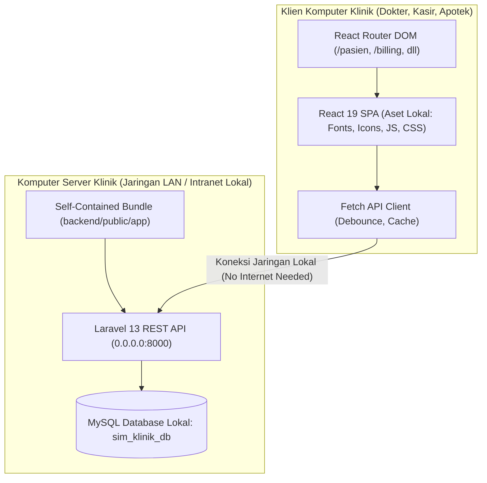
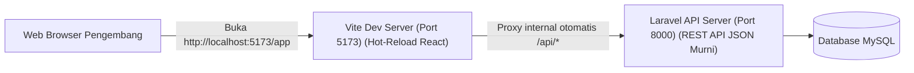
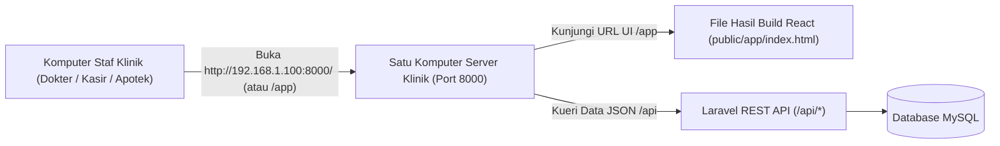

# Dokumen Rekomendasi Modernisasi Arsitektur & Optimasi SIM Klinik

> **Status Dokumen**: Panduan Arsitektur & Rencana Aksi (Action Plan)  
> **Target Aplikasi**: SIM Klinik Pratama Sehat (Laravel 13 REST API + React 19 Vite SPA)  
> **Tujuan**:
> 1. Meningkatkan performa kecepatan aplikasi (ringan, responsif, dan *smooth*).
> 2. Menerapkan navigasi URL berbasis routing (`react-router-dom`).
> 3. **Menjamin sistem dapat beroperasi 100% Offline (Intranet Lokal Klinik) tanpa ketergantungan internet maupun CDN eksternal.**
> 4. **Menetapkan standar alur menjalankan aplikasi (Mode Development vs Mode Production).**
> 5. Menuntaskan migrasi penuh (*Zero Legacy Debt*) dengan menghapus folder `backend/legacy/`.

---

## Daftar Isi
1. [Ringkasan Eksekutif & Status Arsitektur](#1-ringkasan-eksekutif--status-arsitektur)
2. [Fase 1: Kesiapan Operasional 100% Offline (Bebas Internet & CDN)](#2-fase-1-kesiapan-operasional-100-offline-bebas-internet--cdn)
   - [1.1 Audit Ketergantungan Eksternal (CDN) Saat Ini](#11-audit-ketergantungan-eksternal-cdn-saat-ini)
   - [1.2 Lokalisasi Font (Menghapus Google Fonts CDN)](#12-lokalisasi-font-menghapus-google-fonts-cdn)
   - [1.3 Audit & Lokalisasi Pustaka, Skrip, dan Ikon](#13-audit--lokalisasi-pustaka-skrip-dan-ikon)
   - [1.4 Perbaikan Hardcoded Hostname/IP untuk Intranet LAN Klinik](#14-perbaikan-hardcoded-hostnameip-untuk-intranet-lan-klinik)
   - [1.5 Konfigurasi Server Offline & Distribusi Mandiri (Self-Contained)](#15-konfigurasi-server-offline--distribusi-mandiri-self-contained)
3. [Fase 2: Optimasi Kinerja & Kecepatan (Aplikasi Lebih Ringan & Smooth)](#3-fase-2-optimasi-kinerja--kecepatan-aplikasi-lebih-ringan--smooth)
   - [2.1 Frontend (React 19 + Vite)](#21-frontend-react-19--vite)
   - [2.2 Backend (Laravel 13) & Database (MySQL)](#22-backend-laravel-13--database-mysql)
4. [Fase 3: Implementasi Routing URL Frontend (React Router)](#4-fase-3-implementasi-routing-url-frontend-react-router)
   - [3.1 Masalah Saat Ini (Navigasi Tanpa Route)](#31-masalah-saat-ini-navigasi-tanpa-route)
   - [3.2 Desain Struktur URL Halaman](#32-desain-struktur-url-halaman)
   - [3.3 Panduan Implementasi Langkah demi Langkah](#33-panduan-implementasi-langkah-demi-langkah)
   - [3.4 Penyesuaian Server Web (Laravel SPA Fallback)](#34-penyesuaian-server-web-laravel-spa-fallback)
5. [Fase 4: Standar & Panduan Menjalankan Aplikasi (Development vs Production)](#5-fase-4-standar--panduan-menjalankan-aplikasi-development-vs-production)
   - [5.1 Mengapa Port 5173 dan Port 8000 Saat Ini Menampilkan Halaman yang Sama?](#51-mengapa-port-5173-dan-port-8000-saat-ini-menampilkan-halaman-yang-sama)
   - [5.2 Standar Menjalankan Saat Tahap Pengembangan (Development Mode)](#52-standar-menjalankan-saat-tahap-pengembangan-development-mode)
   - [5.3 Standar Menjalankan Saat Tahap Operasional Klinik (Production / Single-Port)](#53-standar-menjalankan-saat-tahap-operasional-klinik-production--single-port)
   - [5.4 Penonaktifan Rute Monolitik Blade & Legacy di Laravel](#54-penonaktifan-rute-monolitik-blade--legacy-di-laravel)
6. [Fase 5: Pembersihan Total Modul Legacy (Zero Legacy Debt)](#6-fase-5-pembersihan-total-modul-legacy-zero-legacy-debt)
   - [6.1 Analisis Ketergantungan Tersisa](#61-analisis-ketergantungan-tersisa)
   - [6.2 Langkah Migrasi Master Data](#62-langkah-migrasi-master-data)
   - [6.3 Langkah Migrasi Mesin Laporan](#63-langkah-migrasi-mesin-laporan)
   - [6.4 Pembersihan Controller, Rute, dan Folder Legacy](#64-pembersihan-controller-rute-dan-folder-legacy)
7. [Tabel Prioritas & Roadmap Eksekusi](#7-tabel-prioritas--roadmap-eksekusi)

---

## 1. Ringkasan Eksekutif & Status Arsitektur

Saat ini aplikasi berada dalam status **transisi arsitektur**:
- **Layer Modern**: React 19 SPA di folder `frontend/` sudah mampu berkomunikasi dengan Laravel 13 REST API di `backend/app/Http/Controllers/Api/` menggunakan kredensial session cookie.
- **Ketergantungan Internet (Non-Offline)**:
  Berkas [`frontend/index.html`](file:///d:/Project/simklinik/frontend/index.html) masih memanggil font dari Google Fonts CDN (`fonts.googleapis.com` dan `fonts.gstatic.com`). Pada kondisi klinik tanpa internet, pemanggilan ini menyebabkan browser mengalami *blocking* (menunggu timeout 3–5 detik), teks berkedip (*Flash of Unstyled Text*), atau tampilan rusak.
- **Hambatan Jaringan Lokal (Intranet)**:
  Terdapat URL gambar logo yang masih di-hardcode ke `http://127.0.0.1:8000/`, sehingga jika server klinik diakses oleh PC kasir atau dokter via IP lokal (misal: `192.168.1.100`), aset gambar akan gagal termuat.
- **Dualisme Tampilan Port 5173 vs Port 8000**:
  Saat ini port 5173 (React SPA) dan port 8000 (Blade Monolitik) menampilkan halaman yang tampak serupa, membingungkan alur pengujian karena di port 8000 navigasi masih me-redirect ke modul PHP native lama.
- **Hambatan Performa**:
  1. Semua komponen halaman diimpor secara serentak di `App.jsx` tanpa *code splitting*.
  2. Input pencarian menembak request HTTP pada setiap ketikan tombol tanpa *debounce*.
  3. Query hitung entitas master dijalankan berulang kali ke 18 tabel tanpa *cache*.
  4. Belum ada indeks database komposit pada kolom filter tanggal dan status kunjungan.
- **Hambatan Navigasi**: Alamat URL browser diam di root (`/app` atau `/`) karena perpindahan halaman hanya mengandalkan state `useState('currentView')`.
- **Hutang Teknis (Technical Debt)**: Direktori `backend/legacy/` masih menyimpan file monolitik PHP lama yang mencampur logika database dan tag HTML `<div>`.

Target akhir dari dokumen ini adalah **arsitektur decoupled murni & 100% Offline-Ready**:


---

## 2. Fase 1: Kesiapan Operasional 100% Offline (Bebas Internet & CDN)

Sebuah Sistem Informasi Manajemen Klinik (SIM Klinik) harus dapat beroperasi penuh di jaringan lokal (LAN/Intranet) tanpa bergantung sama sekali pada koneksi internet publik.

### 1.1 Audit Ketergantungan Eksternal (CDN) Saat Ini

Setelah dilakukan audit ke seluruh berkas proyek:
1. **CDN Aktif yang Ditemukan**:
   - `frontend/index.html` (Baris 10–12):
     ```html
     <link rel="preconnect" href="https://fonts.googleapis.com">
     <link rel="preconnect" href="https://fonts.gstatic.com" crossorigin>
     <link href="https://fonts.googleapis.com/css2?family=Plus+Jakarta+Sans:wght@300;400;500;600;700;800&family=Inter:wght@400;500;600;700&display=swap" rel="stylesheet">
     ```
2. **Komponen yang Sudah Mandiri (Aman Offline)**:
   - **Ikon**: Menggunakan `lucide-react` (terbundel via npm) dan file SVG lokal (`frontend/src/components/AppIcon.jsx` & `frontend/public/icons.svg`).
   - **Pustaka JS**: Tidak ada pemanggilan CDN eksternal (tidak ada cdnjs, unpkg, jsdelivr).
   - **Backend**: Tidak ada panggilan outbound HTTP/cURL ke layanan API luar (BPJS, payment gateway luar, dsb.).

---

### 1.2 Lokalisasi Font (Menghapus Google Fonts CDN)

#### Langkah A: Hapus Link Eksternal di `frontend/index.html`
Hapus tag `<link>` ke Google Fonts di dalam tag `<head>` pada [`frontend/index.html`](file:///d:/Project/simklinik/frontend/index.html):
```html
<!-- HAPUS BARIS-BARIS BERIKUT DARI frontend/index.html -->
<link rel="preconnect" href="https://fonts.googleapis.com">
<link rel="preconnect" href="https://fonts.gstatic.com" crossorigin>
<link href="https://fonts.googleapis.com/css2?family=Plus+Jakarta+Sans:wght@300;400;500;600;700;800&family=Inter:wght@400;500;600;700&display=swap" rel="stylesheet">
```

#### Langkah B: Pilih Strategi Font Lokal

##### Opsi 1 (Direkomendasikan): Simpan File Font Lokal (`.woff2`)
1. Buat folder baru: `frontend/public/fonts/`.
2. Masukkan file font offline *Plus Jakarta Sans* dan *Inter* (format `.woff2`) ke dalam folder tersebut:
   - `PlusJakartaSans-Regular.woff2`
   - `PlusJakartaSans-Medium.woff2`
   - `PlusJakartaSans-SemiBold.woff2`
   - `PlusJakartaSans-Bold.woff2`
   - `Inter-Regular.woff2`
   - `Inter-Medium.woff2`
   - `Inter-SemiBold.woff2`
3. Daftarkan font lokal tersebut di berkas [`frontend/src/index.css`](file:///d:/Project/simklinik/frontend/src/index.css) menggunakan `@font-face`:
   ```css
   /* frontend/src/index.css */
   @font-face {
     font-family: 'Plus Jakarta Sans';
     font-style: normal;
     font-weight: 400;
     font-display: swap;
     src: url('/fonts/PlusJakartaSans-Regular.woff2') format('woff2');
   }

   @font-face {
     font-family: 'Plus Jakarta Sans';
     font-style: normal;
     font-weight: 600;
     font-display: swap;
     src: url('/fonts/PlusJakartaSans-SemiBold.woff2') format('woff2');
   }

   @font-face {
     font-family: 'Plus Jakarta Sans';
     font-style: normal;
     font-weight: 700;
     font-display: swap;
     src: url('/fonts/PlusJakartaSans-Bold.woff2') format('woff2');
   }

   @font-face {
     font-family: 'Inter';
     font-style: normal;
     font-weight: 400;
     font-display: swap;
     src: url('/fonts/Inter-Regular.woff2') format('woff2');
   }

   @font-face {
     font-family: 'Inter';
     font-style: normal;
     font-weight: 600;
     font-display: swap;
     src: url('/fonts/Inter-SemiBold.woff2') format('woff2');
   }
   ```

##### Opsi 2 (Alternatif Tanpa Unduh File Font): Modern System Font Stack
Jika tidak ingin menyimpan file `.woff2`, gunakan font bawaan sistem operasi (Windows, macOS, Linux, Android) yang sudah sangat modern, bersih, dan langsung tampil seketika (0 ms tanpa unduh):
```css
/* frontend/src/index.css */
:root {
  --font-main: -apple-system, BlinkMacSystemFont, "Segoe UI", Roboto, "Helvetica Neue", Arial, sans-serif;
  --font-display: "Segoe UI", -apple-system, BlinkMacSystemFont, Roboto, sans-serif;
}

body {
  font-family: var(--font-main);
}
```

---

### 1.3 Audit & Lokalisasi Pustaka, Skrip, dan Ikon

Pastikan seluruh aset grafis dan pustaka pendukung tersimpan secara internal:
1. **Pustaka Icon Lucide**:
   Paket `lucide-react` sudah terpasang di `node_modules` dan di-bundle langsung oleh Vite ke file JavaScript produksi. Tidak ada pemanggilan CDN icon seperti FontAwesome CDN atau Google Material Icons CDN.
2. **DataTables CSS & Custom CSS**:
   - `frontend/src/datatables.min.css` sudah berupa file lokal.
   - `frontend/src/style.css` sudah berupa file lokal.
3. **Logo & Favicon**:
   - `frontend/public/favicon.svg` sudah lokal.
   - `frontend/public/assets/img/` sudah lokal.

---

### 1.4 Perbaikan Hardcoded Hostname/IP untuk Intranet LAN Klinik

Saat berjalan di jaringan lokal offline, alamat server klinik akan diakses melalui IP lokal (misalnya `http://192.168.1.100:8000`). Penggunaan alamat hardcoded `127.0.0.1` atau `localhost` akan membuat komputer klien lain gagal memuat data/gambar.

- **Temuan Masalah**:
  Di [`frontend/src/components/ProfilKlinikView.jsx`](file:///d:/Project/simklinik/frontend/src/components/ProfilKlinikView.jsx#L37):
  ```javascript
  // MASALAH: Hardcode 127.0.0.1:8000
  setLogoPreview(`http://127.0.0.1:8000/${res.data.clinic_logo}`);
  ```
- **Solusi**:
  Ganti dengan path relatif atau dynamic origin browser:
  ```javascript
  // SOLUSI: Menggunakan relative path otomatis mengikuti host & port aktif
  setLogoPreview(`/${res.data.clinic_logo}`);
  ```

---

### 1.5 Konfigurasi Server Offline & Distribusi Mandiri (Self-Contained)

#### A. Binding Host Server ke Jaringan Lokal
Ketika menjalankan backend Laravel di komputer server klinik agar bisa diakses oleh PC kasir dan dokter di jaringan LAN offline:
```bash
# Bind ke 0.0.0.0 agar bisa diakses dari semua IP jaringan lokal
php artisan serve --host=0.0.0.0 --port=8000
```

#### B. Konfigurasi `.env` untuk Intranet LAN
Pada file [`backend/.env`](file:///d:/Project/simklinik/backend/.env):
```ini
APP_ENV=production
APP_DEBUG=false
# Arahkan ke IP lokal server klinik di LAN (contoh: 192.168.1.100)
APP_URL=http://192.168.1.100:8000

# Pastikan session cookie dapat dibagikan di jaringan lokal
SESSION_DRIVER=file
SESSION_LIFETIME=480
SESSION_ENCRYPT=false
SESSION_PATH=/
SESSION_DOMAIN=null
SESSION_SECURE_COOKIE=false
```

---

## 3. Fase 2: Optimasi Kinerja & Kecepatan (Aplikasi Lebih Ringan & Smooth)

### 2.1 Frontend (React 19 + Vite)

#### A. Code Splitting Komponen Halaman (`React.lazy` + `Suspense`)
- **Lokasi**: `frontend/src/App.jsx`
- **Masalah**: Saat ini 15 view diimpor di baris 4–16 secara statis. Pengguna yang hanya ingin membuka Kasir tetap dipaksa mengunduh seluruh modul Dokter, Farmasi, EMR, dll.
- **Solusi**:
  Ganti impor statis dengan dynamic import:
  ```jsx
  import React, { useState, useEffect, lazy, Suspense } from 'react';

  // Lazy load halaman besar
  const DashboardView = lazy(() => import('./components/DashboardView'));
  const PasienView = lazy(() => import('./components/PasienView'));
  const KunjunganView = lazy(() => import('./components/KunjunganView'));
  const PelayananView = lazy(() => import('./components/PelayananView'));
  const RekamMedisView = lazy(() => import('./components/RekamMedisView'));
  const FarmasiView = lazy(() => import('./components/FarmasiView'));
  const BillingView = lazy(() => import('./components/BillingView'));
  const MasterDataView = lazy(() => import('./components/MasterDataView'));
  const LaporanView = lazy(() => import('./components/LaporanView'));
  ```
  Bungkus area konten utama dengan `<Suspense fallback={<LoadingSpinner />}>`.
- **Hasil**: Ukuran bundle awal turun drastis (60–75%), waktu pertama kali buka (*First Contentful Paint*) menjadi sangat cepat.

#### B. Menerapkan Debouncing & Pembatalan Request pada Pencarian
- **Lokasi**: `frontend/src/components/PasienView.jsx` dan `KunjunganView.jsx`
- **Masalah**: Fungsi `handleSearchChange` langsung menjalankan `fetchPasien(e.target.value)` di setiap ketikan keyboard. Mengetik nama 10 huruf memicu 10 HTTP request sekaligus dan menimbulkan lag serta potensi *race condition*.
- **Solusi**:
  Tambahkan fungsi debounce (300ms) menggunakan `useEffect`:
  ```jsx
  // Di dalam PasienView.jsx
  useEffect(() => {
    const handler = setTimeout(() => {
      fetchPasien(searchQuery);
    }, 300);

    return () => clearTimeout(handler);
  }, [searchQuery]);
  ```
- **Hasil**: Mengurangi lalu lintas jaringan sebesar 85–90% dan menghilangkan sensasi tersendat saat mengetik pencarian pasien.

#### C. Melengkapi Metode HTTP Client & AbortController
- **Lokasi**: `frontend/src/api/client.js`
- **Masalah**: Hanya ada `get`, `post`, dan `postForm`. Operasi update dan delete di beberapa komponen terpaksa memakai metode POST palsu (`_method: 'PUT'`).
- **Solusi**:
  Tambahkan method `put` dan `delete` asli serta opsi sinyal pembatalan (`signal`):
  ```javascript
  // frontend/src/api/client.js
  export const api = {
    async get(endpoint, options = {}) {
      const res = await fetch(`${BASE_URL}${endpoint}`, {
        method: 'GET',
        credentials: 'include',
        headers: { 'Accept': 'application/json' },
        signal: options.signal,
      });
      return handleResponse(res);
    },

    async put(endpoint, payload) {
      const res = await fetch(`${BASE_URL}${endpoint}`, {
        method: 'PUT',
        credentials: 'include',
        headers: {
          'Content-Type': 'application/json',
          'Accept': 'application/json',
        },
        body: JSON.stringify(payload),
      });
      return handleResponse(res);
    },

    async delete(endpoint) {
      const res = await fetch(`${BASE_URL}${endpoint}`, {
        method: 'DELETE',
        credentials: 'include',
        headers: { 'Accept': 'application/json' },
      });
      return handleResponse(res);
    },
    // ... post & postForm tetap dipertahankan
  };
  ```

#### D. In-Memory SWR Caching (Stale-While-Revalidate)
- **Lokasi**: `frontend/src/api/client.js`
- **Solusi**: Buat map cache sederhana di memori untuk request `GET` yang jarang berubah (seperti master data, lookup poli, asuransi):
  ```javascript
  const memoryCache = new Map();

  export async function getCached(endpoint, ttlSeconds = 60) {
    const cached = memoryCache.get(endpoint);
    const now = Date.now();
    if (cached && (now - cached.time) < ttlSeconds * 1000) {
      return cached.data;
    }
    const data = await api.get(endpoint);
    memoryCache.set(endpoint, { time: now, data });
    return data;
  }
  ```
- **Hasil**: Perpindahan antar-tab master data terasa 0 ms karena data langsung muncul dari memori.

---

### 2.2 Backend (Laravel 13) & Database (MySQL)

#### A. Tambahkan Indeks Database pada Kolom Sering Dicari
- **Lokasi**: Buat migration baru di `backend/database/migrations/`
- **Analisis Kebutuhan Indeks**:
  1. `kunjungan`: Filter harian mencari berdasarkan `(tgl_kunjungan, status, poli_id)`.
  2. `pasien`: Pencarian harian kasir/resepsionis memeriksa `nik`, `telepon`, dan `nama`.
  3. `stok_mutasi`: Riwayat kartu stok memfilter `(obat_id, tanggal)`.
- **Rekomendasi Migration SQL**:
  ```php
  Schema::table('kunjungan', function (Blueprint $table) {
      $table->index(['tgl_kunjungan', 'status', 'poli_id'], 'idx_kunjungan_filter');
  });

  Schema::table('pasien', function (Blueprint $table) {
      $table->index('nik', 'idx_pasien_nik');
      $table->index('telepon', 'idx_pasien_telepon');
      $table->index('nama', 'idx_pasien_nama');
  });

  Schema::table('stok_mutasi', function (Blueprint $table) {
      $table->index(['obat_id', 'tanggal'], 'idx_mutasi_obat_tgl');
  });
  ```
- **Hasil**: Eksekusi query pencarian antrean dan riwayat pasien tetap berkecepatan <10 ms meskipun database telah menampung puluhan ribu catatan medis.

#### B. Caching Hitungan Master Data di `MasterController`
- **Lokasi**: `backend/app/Http/Controllers/Api/MasterController.php` (method `entities()`)
- **Masalah**: Melakukan iterasi 18 kali `count()` ke database setiap kali aplikasi di-refresh.
- **Solusi**:
  ```php
  use Illuminate\Support\Facades\Cache;

  public function entities(): JsonResponse
  {
      $entities = $this->getEntities();
      
      $result = Cache::remember('master_entities_counts', 300, function () use ($entities) {
          $res = [];
          foreach ($entities as $slug => $config) {
              $query = DB::table($config['table']);
              if (! empty($config['where'])) {
                  $query->whereRaw($config['where']);
              }
              $res[$slug] = array_merge($config, [
                  'slug' => $slug,
                  'count' => $query->count(),
              ]);
          }
          return $res;
      });

      return response()->json(['success' => true, 'data' => $result]);
  }
  ```
  Hapus cache ini (`Cache::forget('master_entities_counts')`) setiap kali ada penambahan, update, atau penghapusan data master.

---

## 4. Fase 3: Implementasi Routing URL Frontend (React Router)

### 3.1 Masalah Saat Ini (Navigasi Tanpa Route)
Di `App.jsx`, navigasi hanya berupa state React:
`const [currentView, setCurrentView] = useState('dashboard');`
Akibatnya:
1. URL di address bar browser tidak pernah berubah.
2. Jika pengguna menekan tombol **F5 (Refresh)**, halaman selalu kembali ke Dashboard.
3. Tombol **Back/Forward browser** tidak berfungsi.
4. Pengguna tidak bisa membagikan link langsung (misal: link pembayaran kasir atau detail pasien).

### 3.2 Desain Struktur URL Halaman
Susunan rute yang rapi dan standar untuk SIM Klinik:

| URL Path | Komponen Halaman | Deskripsi |
|---|---|---|
| `/login` | `LoginView.jsx` | Halaman login otentikasi |
| `/` atau `/dashboard` | `DashboardView.jsx` | Dashboard ringkasan klinik |
| `/pendaftaran` | `RegistrasiDaftarView.jsx` | Form registrasi pendaftaran kunjungan |
| `/pasien` | `PasienView.jsx` | Direktori data pasien & riwayat |
| `/kunjungan` | `KunjunganView.jsx` | Antrean poli & status kunjungan |
| `/pelayanan` | `PelayananView.jsx` | Konsol pemeriksaan dokter |
| `/pelayanan/:kunjunganId` | `PelayananView.jsx` | Pemeriksaan spesifik kunjungan tertentu |
| `/rekam-medis` | `RekamMedisView.jsx` | Berkas rekam medis elektronik (EMR) |
| `/rekam-medis/:id` | `RekamMedisView.jsx` | Detail riwayat EMR pasien |
| `/farmasi` | `FarmasiView.jsx` | Antrean penyiapan & penyerahan obat |
| `/billing` | `BillingView.jsx` | Kasir POS & penerbitan kwitansi |
| `/master` | `MasterDataView.jsx` | Pengelolaan data master klinik |
| `/master/:slug` | `MasterDataView.jsx` | Data master kategori spesifik (contoh: `/master/obat`) |
| `/laporan` | `LaporanView.jsx` | Laporan kunjungan, keuangan & obat |
| `/pengaturan/klinik` | `ProfilKlinikView.jsx` | Profil nama, alamat & logo klinik |
| `/pengaturan/pengguna` | `PenggunaRoleView.jsx` | Pengelolaan user staf & role RBAC |
| `/profil-saya` | Profile Section | Ganti kata sandi & foto profil |

### 3.3 Panduan Implementasi Langkah demi Langkah

#### Langkah 1: Pasang Paket `react-router-dom`
Di folder `frontend/`:
```bash
npm install react-router-dom
```

#### Langkah 2: Bungkus Aplikasi di `src/main.jsx`
```jsx
// frontend/src/main.jsx
import { StrictMode } from 'react';
import { createRoot } from 'react-dom/client';
import { BrowserRouter } from 'react-router-dom';
import './index.css';
import App from './App.jsx';

createRoot(document.getElementById('root')).render(
  <StrictMode>
    <BrowserRouter basename="/app">
      <App />
    </BrowserRouter>
  </StrictMode>
);
```

#### Langkah 3: Susun `App.jsx` Menggunakan `<Routes>` dan `<Route>`
```jsx
// frontend/src/App.jsx
import { Routes, Route, Navigate, useNavigate, useLocation } from 'react-router-dom';
// ... import layout navbar, sidebar, dsb

export default function App() {
  const { isAuthenticated, user, loading } = useAuth();
  const navigate = useNavigate();
  const location = useLocation();

  if (loading) return <LoadingScreen />;

  if (!isAuthenticated) {
    return <LoginView onLoginSuccess={() => navigate('/dashboard')} />;
  }

  return (
    <div className="app-container">
      <Sidebar currentPath={location.pathname} onNavigate={(path) => navigate(path)} />
      <div className="main-content">
        <Topbar user={user} />
        <Suspense fallback={<LoadingSpinner />}>
          <Routes>
            <Route path="/" element={<Navigate to="/dashboard" replace />} />
            <Route path="/dashboard" element={<DashboardView />} />
            <Route path="/pendaftaran" element={<RegistrasiDaftarView />} />
            <Route path="/pasien" element={<PasienView />} />
            <Route path="/kunjungan" element={<KunjunganView />} />
            <Route path="/pelayanan" element={<PelayananView />} />
            <Route path="/pelayanan/:kunjunganId" element={<PelayananView />} />
            <Route path="/rekam-medis" element={<RekamMedisView />} />
            <Route path="/farmasi" element={<FarmasiView />} />
            <Route path="/billing" element={<BillingView />} />
            <Route path="/master" element={<MasterDataView />} />
            <Route path="/master/:slug" element={<MasterDataView />} />
            <Route path="/laporan" element={<LaporanView />} />
            <Route path="/pengaturan/klinik" element={<ProfilKlinikView />} />
            <Route path="/pengaturan/pengguna" element={<PenggunaRoleView />} />
            <Route path="*" element={<NotFoundView />} />
          </Routes>
        </Suspense>
      </div>
    </div>
  );
}
```

### 3.4 Penyesuaian Server Web (Laravel SPA Fallback)
Agar browser tidak menghasilkan error 404 ketika pengguna me-refresh halaman seperti `http://192.168.1.100:8000/app/pasien`, tambahkan rute fallback di `backend/routes/web.php`:
```php
// backend/routes/web.php
Route::get('/app/{any?}', function () {
    return file_get_contents(public_path('app/index.html'));
})->where('any', '.*');
```

---

## 5. Fase 4: Standar & Panduan Menjalankan Aplikasi (Development vs Production)

Bagian ini menjawab kebingungan mengenai mengapa port `5173` dan port `8000` saat ini menampilkan tampilan serupa dan bagaimana standar pengoperasian yang benar.

### 5.1 Mengapa Port 5173 dan Port 8000 Saat Ini Menampilkan Halaman yang Sama?

Meskipun terlihat sama secara visual, **di balik layar keduanya mengeksekusi sistem yang sama sekali berbeda**:

| URL | Sistem yang Sebenarnya Berjalan | Mekanisme di Balik Layar |
|---|---|---|
| **`http://localhost:5173/app/`** | **Frontend Modern (React 19 SPA)** | Dijalankan oleh server Vite. Render komponen dilakukan oleh JavaScript React di browser, data diambil dari REST API (`/api/*`). |
| **`http://127.0.0.1:8000/`** | **Monolitik Lama (Blade + Legacy PHP)** | Dijalankan oleh server Laravel. Menampilkan template Blade lama (`resources/views/dashboard/index.blade.php`). Jika menu diklik, URL me-redirect ke modul PHP native di `backend/legacy/modules/...`. |

**Alasan Tampilannya Tampak Serupa**:
Frontend React 19 dibangun menggunakan stylesheet dan class CSS yang sama (`style.css`, topbar, sidebar, tata letak tabel) agar transisi tampilan tetap konsisten bagi staf klinik. Namun:
- Di port **5173**, Anda sedang menguji **React 19 SPA modern**.
- Di port **8000**, Anda masih melihat **Blade PHP monolitik lama**.

---

### 5.2 Standar Menjalankan Saat Tahap Pengembangan (Development Mode)

Saat Anda sedang mengembangkan atau mengedit kode, jalankan **2 terminal**, tetapi perhatikan peran masing-masing:



1. **Terminal 1 (Backend)**:
   ```bash
   cd backend
   php artisan serve
   ```
   - **Peran**: **Hanya sebagai REST API Server**.
   - **Aturan**: Anda **TIDAK PERLU membuka `http://127.0.0.1:8000/` di browser**. Port 8000 dibiarkan berjalan di terminal untuk melayani panggilan JSON di `/api/*`.
2. **Terminal 2 (Frontend)**:
   ```bash
   cd frontend
   npm run dev
   ```
   - **Peran**: **Satu-satunya link yang Anda buka di browser**: `http://localhost:5173/app/`.
   - **Keuntungan**: Memiliki fitur *Hot Module Replacement (HMR)* — setiap kali Anda mengubah file komponen React atau CSS, tampilan browser langsung ter-update seketika dalam hitungan milidetik tanpa reload browser.

---

### 5.3 Standar Menjalankan Saat Tahap Operasional Klinik (Production / Single-Port)

Di lingkungan klinik nyata (offline intranet), staf (dokter, kasir, farmasi) **TIDAK MENJALANKAN dua server**, dan komputer server klinik **TIDAK MEMERLUKAN Node.js**.

Arsitektur finalnya menjadi **Single Server Deployment**:



#### Langkah Deployment Produksi:
1. **Kompilasi Frontend (Dilakukan di Komputer Pengembang)**:
   ```bash
   cd frontend
   npm run build
   ```
   Vite akan menghasilkan file statis bundle (`index.html`, file JS dan CSS teroptimasi) di dalam folder `frontend/dist/`.
2. **Salin ke Folder Public Backend**:
   Salin seluruh isi `frontend/dist/` ke `backend/public/app/`.
3. **Jalankan Hanya Satu Server di Komputer Klinik**:
   ```bash
   cd backend
   php artisan serve --host=0.0.0.0 --port=8000
   ```
   (Atau dijalankan di background menggunakan Apache/Nginx lokal bawaan XAMPP/Laragon).
4. **Akses dari Komputer Staf**:
   Seluruh komputer dokter, kasir, dan apotek di jaringan lokal cukup membuka satu alamat resmi di browser:
   **`http://192.168.1.100:8000/`** (atau `http://192.168.1.100:8000/app`).

---

### 5.4 Penonaktifan Rute Monolitik Blade & Legacy di Laravel

Untuk mengakhiri dualisme tampilan antara Blade lama dan React baru, ubah file [`backend/routes/web.php`](file:///d:/Project/simklinik/backend/routes/web.php) sehingga rute utama langsung menyajikan React SPA:

```php
<?php
// backend/routes/web.php (Konfigurasi Produksi Bersih)

use Illuminate\Support\Facades\Route;

// Redirect root langsung ke Single Page Application React
Route::get('/', fn () => redirect('/app'));

// Sajikan Compiled SPA React untuk seluruh rute /app/*
Route::get('/app/{any?}', function () {
    $indexPath = public_path('app/index.html');
    if (! file_exists($indexPath)) {
        return response("Aplikasi frontend belum di-build. Silakan jalankan 'npm run build' di folder frontend terlebih dahulu.", 503);
    }
    return file_get_contents($indexPath);
})->where('any', '.*')->name('spa');

// Rute locale switcher (bila diperlukan)
Route::get('/locale/{locale}', [\App\Http\Controllers\LocaleController::class, 'switch'])
    ->name('locale.switch');

// CATATAN: Seluruh rute Blade lama (/dashboard, /login Blade, dan /legacy/{path})
// sudah dinonaktifkan dan dihapus sepenuhnya.
```

Dengan langkah ini:
- Port 8000 menjadi pintu gerbang tunggal yang menyajikan **100% React SPA**.
- Tidak ada lagi kebingungan halaman mana yang sedang berjalan.

---

## 6. Fase 5: Pembersihan Total Modul Legacy (Zero Legacy Debt)

### 6.1 Analisis Ketergantungan Tersisa
Folder `backend/legacy/` berukuran besar dan berisi kode lama PHP native. Dari penelusuran seluruh backend, **hanya ada dua titik** di mana API modern masih meminjam file dari `legacy/`:
1. `MasterController.php` meminjam definisi field dari `legacy/modules/master/entities.php`.
2. `LaporanController.php` meminjam eksekusi query dari `legacy/modules/laporan/reports.php`.

Sedangkan modul-modul lain (Pasien, Kunjungan, Pelayanan Dokter, EMR, Farmasi, Billing, Kasir POS, Akun, Setting) **sudah 100% ditulis ulang menjadi REST API modern di Laravel**.

### 6.2 Langkah Migrasi Master Data
1. Buat file konfigurasi Laravel baru: [`backend/config/master_entities.php`](file:///d:/Project/simklinik/backend/config).
2. Pindahkan seluruh isi array skema entitas (daftar tabel, field label, tipe input, validasi, dan icon) dari `legacy/modules/master/entities.php` ke file konfigurasi ini:
   ```php
   <?php
   // backend/config/master_entities.php
   return [
       'tindakan' => [
           'label' => 'Tindakan Medis',
           'table' => 'tindakan',
           'group' => 'Layanan & Tarif',
           'icon_name' => 'syringe',
           'order' => 'nama',
           'fields' => [
               'kode' => ['label' => 'Kode Tindakan', 'type' => 'text', 'required' => true, 'list' => true],
               'nama' => ['label' => 'Nama Tindakan', 'type' => 'text', 'required' => true, 'list' => true],
               'tarif' => ['label' => 'Tarif Dasar', 'type' => 'money', 'list' => true],
               'harga_jual' => ['label' => 'Tarif Jual', 'type' => 'money', 'list' => true],
               'status' => ['label' => 'Status', 'type' => 'enum', 'options' => ['aktif', 'nonaktif'], 'default' => 'aktif', 'list' => true],
           ],
       ],
       'poli' => [ ... ],
       'dokter' => [ ... ],
       'obat' => [ ... ],
       // ... seluruh entitas lainnya
   ];
   ```
3. Ubah method `getEntities()` di [`MasterController.php`](file:///d:/Project/simklinik/backend/app/Http/Controllers/Api/MasterController.php):
   ```php
   // Dari sebelumnya memanggil require_once base_path('legacy/...')
   // Menjadi murni pembacaan config:
   private function getEntities(): array
   {
       return config('master_entities', []);
   }
   ```

### 6.3 Langkah Migrasi Mesin Laporan
1. Buat service class baru di Laravel: [`backend/app/Services/ReportService.php`](file:///d:/Project/simklinik/backend/app/Services).
2. Pindahkan query builder laporan kunjungan, pendapatan, omset obat, dan piutang penjamin dari `legacy/modules/laporan/reports.php` ke dalam method di class tersebut:
   ```php
   <?php
   namespace App\Services;

   use Illuminate\Support\Facades\DB;

   class ReportService
   {
       public function getSummary(string $dari, string $sampai): array { ... }
       public function getReport(string $jenis, string $dari, string $sampai): array { ... }
   }
   ```
3. Suntikkan `ReportService` ke dalam [`LaporanController.php`](file:///d:/Project/simklinik/backend/app/Http/Controllers/Api/LaporanController.php) dan hapus method `bootstrapLegacy()`.

### 6.4 Pembersihan Controller, Rute, dan Folder Legacy
Setelah Langkah 6.2 dan 6.3 selesai:
1. **Hapus Controller Jembatan**:
   Hapus berkas `backend/app/Http/Controllers/LegacyController.php`.
2. **Hapus Rute Proxy Legacy**:
   Pastikan blok `Route::match(['get', 'post'], '/legacy/{path}', ...)` sudah terhapus dari `backend/routes/web.php`.
3. **Hapus Menu Service Blade Lama**:
   Hapus berkas `backend/app/Services/MenuService.php` (karena navigasi menu sidebar kini sepenuhnya diatur oleh React di `frontend/src/App.jsx`).
4. **Hapus Seluruh Folder Legacy**:
   Hapus direktori `backend/legacy/` beserta seluruh isinya:
   ```bash
   # Dapat dihapus permanen
   rmdir /s /q backend\legacy
   ```

---

## 7. Tabel Prioritas & Roadmap Eksekusi

| Prioritas | Kegiatan | Lokasi File Terkait | Estimasi Waktu | Dampak |
|---|---|---|---|---|
| **0 (Wajib Offline)** | **Hapus Google Fonts CDN & Lokalisasi Font** | `frontend/index.html`, `frontend/src/index.css` | 20 menit | Menghilangkan ketergantungan internet publik & lag timeout |
| **0 (Wajib Offline)** | **Perbaiki Hardcoded Hostname `127.0.0.1`** | `frontend/src/components/ProfilKlinikView.jsx` | 10 menit | Menjamin gambar & logo tampil di seluruh PC jaringan LAN |
| **1 (Kritis & Cepat)** | Tambah **Debounce 300ms** pada form search pasien | `frontend/src/components/PasienView.jsx` | 30 menit | Menghilangkan 85% request berlebih dan lag ketikan |
| **1 (Kritis & Cepat)** | Tambah **Index Database** (`kunjungan`, `pasien`) | `backend/database/migrations/` | 30 menit | Query pencarian & antrean puluhan kali lebih cepat |
| **1 (Kritis & Cepat)** | Pasang **Cache Laravel** pada hitungan master | `backend/app/Http/Controllers/Api/MasterController.php` | 20 menit | Mengurangi 18 query SQL berulang per load |
| **2 (Arsitektur)** | Pasang **`react-router-dom`** & URL routing | `frontend/src/App.jsx`, `main.jsx`, `routes/web.php` | 2 - 3 jam | Halaman memiliki link resmi, support reload (F5) & back button |
| **2 (Arsitektur)** | **Arahkan Rute Laravel Web ke SPA Build** | `backend/routes/web.php` | 30 menit | Mengakhiri dualisme tampilan port 5173 vs 8000 |
| **2 (Performa)** | Pasang **`React.lazy` + `Suspense`** di semua view | `frontend/src/App.jsx` | 45 menit | Waktu loading awal aplikasi berkurang drastis |
| **3 (Pembersihan)** | Pindahkan `master_entities` ke `config/` | `backend/config/master_entities.php` | 1 - 2 jam | Menghilangkan ketergantungan pertama ke modul legacy |
| **3 (Pembersihan)** | Buat `ReportService.php` untuk laporan | `backend/app/Services/ReportService.php` | 2 jam | Menghilangkan ketergantungan kedua ke modul legacy |
| **3 (Pembersihan)** | Hapus `LegacyController.php` & folder `legacy/` | `backend/legacy/`, `backend/routes/web.php` | 30 menit | Codebase bersih 100%, ukuran proyek menyusut, tanpa hutang teknis |

---

