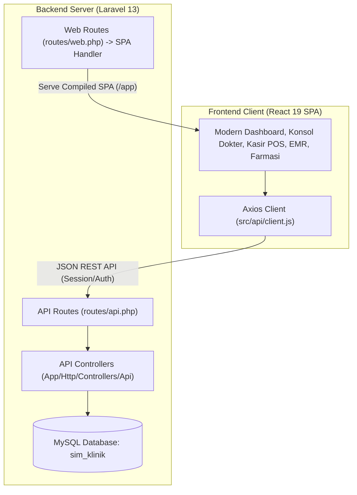

# SIM Klinik (Sistem Informasi Manajemen Klinik)
## Arsitektur Terpisah: Laravel 13 REST API & React 19 Vite SPA

Sistem Informasi Manajemen Klinik Pratama Sehat yang telah dimodernisasi dari monolitik PHP legacy menjadi arsitektur decoupled modern:
- **Backend**: Laravel 13 RESTful API dengan Eloquent ORM, transaksi database atomik, dan PHPUnit Test Suite.
- **Frontend**: React 19 SPA (Single Page Application) dibangun dengan Vite, CSS Variables & Design Tokens kustom (tanpa dependensi framework CSS eksternal), serta Google Fonts (*Plus Jakarta Sans* & *Inter*).

---

## 🏛️ Arsitektur Sistem



---

## 🚀 Cara Menjalankan Aplikasi

### 1. Menjalankan Backend (Laravel)
Pastikan MySQL telah aktif dan database `sim_klinik` telah terisi.
```bash
cd backend
php artisan serve
```
Backend berjalan di: **`http://127.0.0.1:8000`**

### 2. Menjalankan Frontend (React + Vite Dev Server)
```bash
cd frontend
npm run dev
```
Frontend development server berjalan dengan hot-module-reload di: **`http://localhost:5173`**

### 3. Akses Langsung Single Page Application (Production Build)
Bundle produksi telah terintegrasi langsung ke Laravel public:
- Kunjungi langsung: **`http://127.0.0.1:8000/`** atau **`http://127.0.0.1:8000/app`**

Kredensial Default Login:
- **Username**: `admin`
- **Password**: `admin123`

---

## 📋 Modul & Fitur yang Tersedia

| No | Modul | Endpoint API Utama | Komponen Frontend | Deskripsi |
|---|---|---|---|---|
| 1 | **Dashboard** | `GET /api/dashboard/stats` | `DashboardView.jsx` | Metrik KPI real-time klinik, antrean terkini, peringatan stok obat kritis, dan shortcut cepat operasional. |
| 2 | **Pelayanan Dokter** | `GET /api/pelayanan/antrean`<br>`POST /api/pelayanan/periksa/{id}` | `PelayananView.jsx` | Konsol dokter: tanda vital, kalkulator otomatis BMI, SOAP, ICD-10 suggestions, tindakan medis & E-Resep. |
| 3 | **Rekam Medis (EMR)** | `GET /api/rekam-medis/{id}` | `RekamMedisView.jsx` | Direktori berkas rekam medis pasien dengan modal tampilan klinis & tombol cetak resume medis (`window.print`). |
| 4 | **Daftar Kunjungan** | `GET /api/kunjungan`<br>`POST /api/kunjungan` | `KunjunganView.jsx` | Manajemen antrean poli real-time, pendaftaran kunjungan, pemanggilan nomor antrean, dan alih status. |
| 5 | **Data Pasien** | `GET /api/pasien`<br>`POST /api/pasien` | `PasienView.jsx` | Direktori pasien, pencarian cepat, No. Rekam Medis otomatis (`GBKXXXX`), dan form registrasi pasien baru. |
| 6 | **Kasir & Billing** | `GET /api/billing`<br>`POST /api/billing/bayar/{id}` | `BillingView.jsx` | POS kasir: agregasi biaya, diskon, kembalian uang tunai, multi-metode (Cash, Transfer, QRIS, Asuransi), cetak kwitansi resmi. |
| 7 | **Farmasi & Logistik** | `GET /api/farmasi/antrean`<br>`POST /api/farmasi/serah/{id}` | `FarmasiView.jsx` | Penyerahan obat dokter, pemotongan stok otomatis & pencatatan `stok_mutasi`, serta cetak etiket obat. |
| 8 | **Master Data** | `GET /api/master/{entity}`<br>`POST/PUT/DELETE /api/master/{entity}` | `MasterDataView.jsx` | CRUD Poli, Dokter, Jadwal Dokter, Obat, Satuan, Kategori, Supplier, Tindakan Medis, Kelompok Pasien, Asuransi. |
| 9 | **Laporan & Rekap** | `GET /api/laporan/{kunjungan\|pendapatan\|obat\|piutang}` | `LaporanView.jsx` | 4 laporan terperinci dengan filter tanggal, kalkulasi total otomatis, export file CSV, dan format cetak dokumen. |
| 10 | **Profil Saya** | `GET /api/profile`<br>`POST /api/profile/password` | `ProfilePage.jsx` / `App.jsx` | Pengelolaan profil pengguna, upload avatar foto, dan ganti kata sandi. |

---

## 🧪 Pengujian Otomatis (Testing)

Proyek ini dilengkapi dengan 19 Automated Feature Tests di Laravel dengan 202 assertions yang menguji seluruh alur fungsional dan integritas data secara komprehensif.

Untuk menjalankan seluruh test suite:
```bash
cd backend
php artisan test
```

### Hasil Test:
```
PASS  Tests\Feature\ApiAuthAndProfileTest (3 tests, 28 assertions)
PASS  Tests\Feature\ApiMasterCrudTest (3 tests, 20 assertions)
PASS  Tests\Feature\ApiPasienDanKunjunganTest (4 tests, 32 assertions)
PASS  Tests\Feature\ApiPelayananDanRmeTest (2 tests, 26 assertions)
PASS  Tests\Feature\ApiFarmasiDanBillingTest (2 tests, 28 assertions)
PASS  Tests\Feature\ApiDashboardDanLaporanTest (5 tests, 56 assertions)
PASS  Tests\Feature\EndToEndClinicFlowTest (1 test, 38 assertions)

Tests:    19 passed (202 assertions)
Duration: ~1.10s
```

---

## 📦 Build Produksi Frontend

Untuk memperbarui bundle produksi React:
```bash
cd frontend
npm run build
```
Hasil build berada di `frontend/dist/` dan dapat disalin ke `backend/public/app/`.
